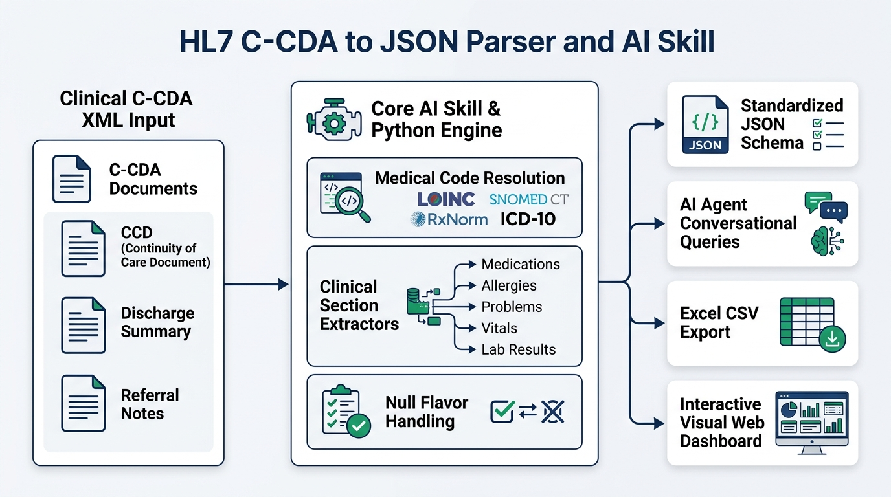

# C-CDA to JSON Parser and AI Skill

[](https://www.python.org/downloads/)
[](https://opensource.org/licenses/Apache-2.0)
[](#requirements)
[](https://www.hl7.org/implement/standards/product_brief.cfm?product_id=408)

A production-grade, zero-external-dependency Python engine and AI Skill that converts HL7 C-CDA (Consolidated Clinical Document Architecture) XML clinical documents into structured, standardized JSON.

Ready for direct integration into enterprise AI assistants, Claude, OpenAI Agents, FastAPI, or clinical data engineering pipelines.

<p align="center">
  
</p>

---

## Non-Technical User Guide

### Overview
When healthcare providers (such as hospitals, medical clinics, and private practices) exchange patient medical records, they typically export files formatted according to the **HL7 C-CDA** (Consolidated Clinical Document Architecture) standard.

C-CDA files are encoded in XML. While structured and comprehensive, raw XML files contain hundreds of technical identifiers, nested schemas, and medical ontology codes that are difficult to read directly without specialized clinical informatics training.

This software converts complex C-CDA XML medical records into clean **JSON data**, plain-text **clinical summaries**, **Microsoft Excel-compatible spreadsheets**, and **interactive visual web dashboards**.

---

### How to Use This Skill

#### 1. Interacting Through an AI Assistant
When this skill is installed in an AI assistant or chat platform, you can query and analyze patient documents using standard English instructions:

- **Extracting Active Medications**:
  - *User*: "What medications is this patient currently taking, and what are the prescribed doses?"
  - *Assistant*: Extracts all active prescriptions (medication name, dosage quantity, administration route, frequency schedule, and clinical indication) from the document and presents them in a clean table.
- **Reviewing Allergies and Adverse Reactions**:
  - *User*: "Does this patient have any documented drug or food allergies?"
  - *Assistant*: Identifies all allergen substances, reaction descriptions, severity levels, and clinical statuses.
- **Summarizing Hospital Discharge**:
  - *User*: "Summarize the hospital course, discharge diagnoses, and follow-up instructions for this patient."
  - *Assistant*: Parses the inpatient discharge summary and provides an executive bullet-point briefing.
- **Generating a Visual Dashboard**:
  - *User*: "Generate a visual report for this patient's Continuity of Care Document."
  - *Assistant*: Creates a self-contained HTML dashboard with clinical charts, vital sign indicators, and dual file inspection.

---

#### 2. Practical Examples for Common Workflows

##### Example 1: View an Interactive Patient Dashboard in Your Web Browser
You can generate and view a visual patient dashboard in any modern web browser (Google Chrome, Microsoft Edge, Mozilla Firefox, or Apple Safari):

```bash
python3 parse.py samples/sample_1_continuity_of_care_document.xml --html-report patient_dashboard.html
```

- **What it does**: Creates a self-contained HTML file (`patient_dashboard.html`).
- **How to view**: Double-click the generated file or open it in your browser.
- **What you will see**: An executive dashboard displaying patient demographics, vital sign indicators, active medication cards, condition timelines, laboratory results, clinical tables, and side-by-side XML-to-JSON code comparison with light and dark mode toggles.

---

##### Example 2: Export Medical Data into Microsoft Excel Spreadsheets
To analyze clinical data using spreadsheet software, export the document into separate CSV spreadsheet files:

```bash
python3 parse.py samples/sample_1_continuity_of_care_document.xml --csv-export ./my_spreadsheets/
```

- **What it does**: Creates a folder containing organized spreadsheet files:
  - `medications.csv` (Prescription names, dosages, routes, frequencies, indications)
  - `allergies.csv` (Allergen substances, reactions, severity, clinical status)
  - `problems.csv` (Diagnoses, ICD-10 codes, SNOMED CT codes, onset dates)
  - `vital_signs.csv` (Blood pressure, heart rate, temperature, oxygen saturation, BMI)
  - `lab_results.csv` (Laboratory tests, numeric values, reference ranges, abnormal flags)
- **How to view**: Open any of the `.csv` files directly in Microsoft Excel, Apple Numbers, or standard spreadsheet applications.

---

##### Example 3: Print a Readable Clinical Summary in the Terminal
To inspect a clinical document without generating files:

```bash
python3 parse.py samples/sample_1_continuity_of_care_document.xml --summary
```

- **What it does**: Outputs a formatted text overview directly to your terminal:
  - Patient demographics (Full Name, Date of Birth, Gender, Document Date)
  - Element counts (Total Allergies, Medications, Conditions, Vitals, Labs, Encounters)
  - Available clinical sections

---

##### Example 4: Convert XML to Structured JSON
To produce a clean JSON file for data pipelines or software integrations:

```bash
python3 parse.py samples/sample_1_continuity_of_care_document.xml -o output.json --pretty
```

- **What it does**: Saves a formatted, standardized JSON file to `output.json`.

---

## Key Features

- **Comprehensive Clinical Domain Coverage**:
  - **Patient Demographics**: Full name, date of birth, administrative gender, marital status, race, ethnicity, addresses, telecom contacts, emergency guardians, medical record numbers (MRNs), and provider organizations.
  - **Allergies and Intolerances**: Allergen substance codes (RxNorm, UNII), reaction manifestations, severity ratings, clinical status, and onset dates.
  - **Medications**: Generic and brand names, RxNorm codes, dosage values, routes of administration, dosing schedules, start/end dates, clinical indications, and instructions.
  - **Problems and Diagnoses**: SNOMED CT concepts with ICD-10-CM crosswalks, clinical status (active, resolved, inactive), onset dates, and age at onset.
  - **Vital Signs**: Systolic and diastolic blood pressure, resting heart rate, respiratory rate, body temperature, body mass index (BMI), oxygen saturation (SpO2), height, and weight measurements with standard units.
  - **Diagnostic Labs and Results**: Chemistry panels, hematology panels, cardiac biomarkers, LOINC test codes, numeric values, reference ranges, and abnormal high/low flags.
  - **Immunizations**: CDC Vaccine Administered (CVX) codes, administration dates, lot numbers, routes, manufacturer names, and refusal reasons.
  - **Encounters and Clinical Visits**: Outpatient visits, inpatient admissions, consultations, provider specialties, facility locations, and encounter diagnoses.
  - **Procedures**: Surgical and diagnostic procedures (CPT-4, SNOMED CT, ICD-10-PCS), procedure dates, performing clinicians, and anatomical target sites.
  - **Social History**: Standardized smoking status (NHIS codes), tobacco history, alcohol intake, and social history observations.
  - **Plan of Care and Instructions**: Treatment plans, planned orders, scheduled appointments, and post-discharge patient instructions.
- **Robust XML Syntax Handling**:
  - Automatically handles XML namespaces (`urn:hl7-org:v3`, `sdtc:`, `xsi:`, `voc:`).
  - Resolves internal narrative references (`<reference value="#med1"/>`) to populate display names when coded attributes omit them.
  - Gracefully handles null flavor indicators (`UNK`, `NA`, `NI`, `ASKU`, `NASK`, `MSK`, `OTH`) without crashing.
  - Converts HL7 timestamp strings (`20230514143000-0500`, `20230514`) to standardized ISO-8601 dates and timestamps.
  - Extracts embedded HTML narrative tables (`<table>`, `<thead>`, `<tbody>`, `<tr>`, `<th>`, `<td>`) into structured arrays.
- **Zero Mandatory Dependencies**: Built entirely on the Python Standard Library (`xml.etree.ElementTree`, `json`, `csv`, `re`, `datetime`). Runs in restricted, serverless, or offline environments without external package installations.
- **Flexible Interfaces**:
  - Python API (`import ccda_parser`)
  - Command Line Interface (CLI) with indentation formatting, batch folder processing, terminal summaries, CSV export, and HTML reports.
  - Standardized `SKILL.md` for AI agent platforms and tool integration systems.
  - Interactive web dashboards with light and dark mode toggles.

---

## Project Structure and File Tree

```
ccda-to-json-parser/
├── LICENSE                                           # Apache 2.0 license file
├── README.md                                          # Project documentation and non-technical guide
├── SKILL.md                                           # AI Agent Skill definition and integration manual
├── parse.py                                           # Direct CLI executable runner script
├── pyproject.toml                                     # Python package build configuration
├── requirements.txt                                   # Python dependencies (standard library first)
├── setup.py                                           # Setup configuration for pip installation
├── docs/
│   ├── ccda_mapping_dashboard.html                    # Interactive mapping matrix web dashboard
│   ├── sample_1_patient_dashboard.html                # Sample patient interactive visual dashboard
│   └── images/
│       └── ccda_skill_demo.jpg                        # Demonstration graphic
├── samples/
│   ├── sample_1_continuity_of_care_document.xml       # Synthetic outpatient CCD XML file
│   ├── sample_2_discharge_summary.xml                # Synthetic inpatient discharge summary XML file
│   ├── sample_3_cardiology_referral_note.xml         # Synthetic cardiology referral note XML file
│   └── converted_json/
│       ├── sample_1_continuity_of_care_document.json # Pre-converted CCD JSON output
│       ├── sample_2_discharge_summary.json           # Pre-converted discharge summary JSON output
│       └── sample_3_cardiology_referral_note.json   # Pre-converted referral note JSON output
├── scripts/
│   ├── convert_all_samples.py                         # Batch sample conversion utility script
│   ├── generate_mapping_dashboard.py                  # Mapping matrix dashboard HTML generator
│   └── validate_ccda.py                               # C-CDA XML structural conformance validator
├── src/
│   └── ccda_parser/
│       ├── __init__.py                                # Public package API and version exports
│       ├── __main__.py                                # Executable module entry point
│       ├── cli.py                                     # Command-line interface with parsing flags
│       ├── models.py                                  # Structured data models and type definitions
│       ├── parser.py                                  # Core C-CDA XML parsing engine
│       ├── visualizer.py                              # Interactive HTML visual report generator
│       ├── sections/                                  # Modular clinical domain section extractors
│       │   ├── __init__.py                            # Section classifier and dispatch router
│       │   ├── allergies.py                           # Allergies and adverse reactions extractor
│       │   ├── encounters.py                          # Clinical encounters and visits extractor
│       │   ├── generic_section.py                     # Fallback extractor for custom narrative sections
│       │   ├── header.py                              # Patient demographics and document metadata
│       │   ├── immunizations.py                       # Vaccines and immunization history extractor
│       │   ├── medications.py                         # Medications and prescription extractor
│       │   ├── problems.py                            # Problem list, conditions, and diagnoses extractor
│       │   ├── procedures.py                          # Surgical and diagnostic procedures extractor
│       │   ├── results.py                             # Diagnostic tests and laboratory panels extractor
│       │   ├── social_history.py                      # Smoking status and social history extractor
│       │   └── vital_signs.py                         # Vital signs and physiological panels extractor
│       └── utils/                                     # Parsing utility helper modules
│           ├── __init__.py                            # Utility package initialization
│           ├── code_utils.py                          # Medical terminology and OID resolution
│           ├── date_utils.py                          # HL7 timestamp conversion to ISO-8601
│           ├── narrative_utils.py                     # Narrative text, tables, and reference lookups
│           └── xml_utils.py                           # XML namespace and element traversal helpers
└── tests/
    ├── __init__.py                                    # Test suite package initialization
    ├── test_parser.py                                 # Unit tests for parser utilities and models
    └── test_samples.py                                # End-to-end verification tests on sample files
```

---

## Quick Start

### 1. Python Library Usage

```python
from ccda_parser import parse_ccda, parse_ccda_file

# Parse a C-CDA XML file
data = parse_ccda_file("samples/sample_1_continuity_of_care_document.xml")

# Patient Information
print(data["patient"]["name"]["full_name"])       # "Ms. Eleanor Marie Vance"
print(data["patient"]["birth_time"])              # "1975-08-22"
print(data["patient"]["gender"]["display_name"])  # "Female"

# Active Medications
for med in data["sections"]["medications"]["entries"]:
    name = med["medication"]["display_name"]
    dose = med["dose"]["formatted"]
    status = med["status"]
    print(f"- {name} ({dose}) [{status}]")

# Lab Results
for lab in data["sections"]["results"]["results"]:
    test = lab["test"]["display_name"]
    val = lab["value"]["value"]
    unit = lab["value"]["unit"]
    interp = lab.get("interpretation", {}).get("display_name", "Normal")
    print(f"- {test}: {val} {unit} ({interp})")
```

### 2. Command Line Usage

```bash
# Basic conversion to standard output
python3 parse.py samples/sample_1_continuity_of_care_document.xml

# Save formatted JSON to file
python3 parse.py samples/sample_1_continuity_of_care_document.xml -o output.json --pretty

# Batch convert an entire folder of C-CDA XML files
python3 parse.py ./samples/ -o ./json_output/ --pretty

# Display human-readable clinical summary in terminal
python3 parse.py samples/sample_1_continuity_of_care_document.xml --summary

# Extract specific sections only
python3 parse.py samples/sample_1_continuity_of_care_document.xml --sections allergies,medications,problems -o filtered.json

# Export clinical tables directly to CSV files
python3 parse.py samples/sample_1_continuity_of_care_document.xml --csv-export ./csv_out/

# Generate an interactive HTML patient dashboard
python3 parse.py samples/sample_1_continuity_of_care_document.xml --html-report patient_dashboard.html

# Open or generate the C-CDA to JSON Mapping Matrix visual dashboard
python3 parse.py --mapping-dashboard docs/ccda_mapping_dashboard.html
```

---

## Interactive Visual Dashboards

This project provides rich, interactive visual dashboards designed for web browser environments:

1. **C-CDA to JSON Mapping Matrix Dashboard (`docs/ccda_mapping_dashboard.html`)**:
   - **Interactive Clinical Explorer**: Visual exploration of all 12 clinical domains (Demographics, Allergies, Medications, Problems, Vitals, Labs, Immunizations, Encounters, Procedures, Social History, Care Plan, and Generic Sections).
   - **Side-by-Side Live Transformation**: Direct visual link between source HL7 C-CDA XML snippets and target normalized JSON structures.
   - **Field-by-Field Rules**: Detailed breakdown of XPath expressions, data types (`PQ`, `CD`, `IVL_TS`, `ST`), vocabulary systems (LOINC, SNOMED CT, RxNorm, CVX, ICD-10), and null flavor resilience.
   - **Live Keyword Search and Filter**: Real-time cross-section search.
   - **Light/Dark Display Toggle**: High-contrast, professional user interface.

2. **Patient Visual Dashboard Generator (`--html-report`)**:
   - Generates an executive patient report with vital signs cards, active medication badges, problem lists, allergy alerts, dual input XML & output JSON viewers, and clinical domain tables.

---

## JSON Output Schema

Below is an overview of the structured output schema:

```json
{
  "document_meta": {
    "title": "Continuity of Care Document (CCD)",
    "document_type": {
      "code": "34133-9",
      "code_system_name": "LOINC",
      "display_name": "Summarization of Episode Note"
    },
    "effective_time": "2023-05-14T14:30:00-05:00",
    "confidentiality": {"code": "N", "display_name": "Normal"},
    "authors": [],
    "custodian": {}
  },
  "patient": {
    "name": {
      "full_name": "Ms. Eleanor Marie Vance",
      "first_name": "Eleanor",
      "last_name": "Vance"
    },
    "birth_time": "1975-08-22",
    "gender": {"code": "F", "display_name": "Female"},
    "race": {"code": "2106-3", "display_name": "White"},
    "ethnicity": {"code": "2186-5", "display_name": "Not Hispanic or Latino"},
    "addresses": [],
    "telecoms": []
  },
  "summary": {
    "patient_name": "Ms. Eleanor Marie Vance",
    "date_of_birth": "1975-08-22",
    "gender": "Female",
    "counts": {
      "allergies": 2,
      "medications": 3,
      "problems": 2,
      "immunizations": 1,
      "vital_signs": 3,
      "lab_results": 1,
      "encounters": 0,
      "procedures": 0
    },
    "available_sections": [
      "allergies",
      "medications",
      "problems",
      "vital_signs",
      "results",
      "immunizations",
      "social_history",
      "plan_of_care"
    ]
  },
  "sections": {
    "allergies": {
      "title": "Allergies, Adverse Reactions & Alerts",
      "narrative": "...",
      "tables": [],
      "entries": []
    },
    "medications": {
      "title": "Medications",
      "narrative": "...",
      "tables": [],
      "entries": []
    },
    "problems": {
      "title": "Problems & Health Conditions",
      "entries": []
    },
    "vital_signs": {
      "title": "Vital Signs",
      "panels": [],
      "measurements": []
    },
    "results": {
      "title": "Diagnostic Results & Laboratory Data",
      "panels": [],
      "results": []
    }
  }
}
```

---

## Testing and Verification

Run the test suite to verify that all components function properly:

```bash
# Run all unit tests and sample validation tests
python3 -m unittest discover -s tests -p "test_*.py" -v

# Batch convert all sample files
python3 scripts/convert_all_samples.py

# Validate XML conformance for any C-CDA file
python3 scripts/validate_ccda.py samples/sample_1_continuity_of_care_document.xml
```

---

## Synthetic Sample Files

The repository includes 3 realistic, synthetic clinical documents:

1. **`sample_1_continuity_of_care_document.xml`**: Comprehensive outpatient CCD record for Eleanor Vance with Type 2 Diabetes, Hypertension, Hyperlipidemia, active medications, allergies (Penicillin, Peanut), lab results (HbA1c 6.8%, Lipid panel), vitals, immunizations, and care plan.
2. **`sample_2_discharge_summary.xml`**: Hospital inpatient discharge summary for Marcus Thorne following laparoscopic appendectomy, featuring hospital course narrative, discharge medications, post-operative care instructions, and sulfa allergy.
3. **`sample_3_cardiology_referral_note.xml`**: Specialist consultation note for Sophia Rodriguez presenting with palpitations and heart murmur, including physical exam, vital signs, outpatient encounter billing codes, and diagnostic orders (Holter ECG, Echocardiogram).

---

## License

This project is licensed under the **Apache License 2.0**.
